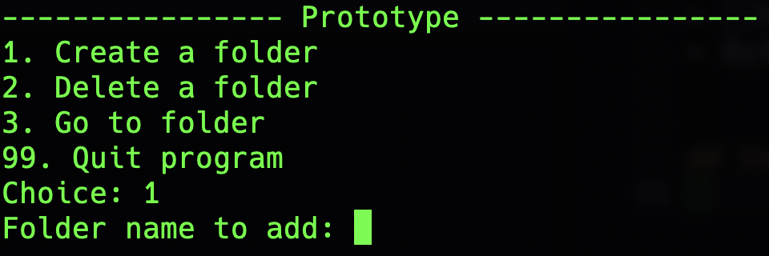

# Prototype
En Python app for å legge til, fjerne, eller bytte mapper lettere enn manuelt på terminalen.

## Kjøring
´´´sh
python3 main.py
´´´

> [!NOTE]
> Bytt til python eller py fra python3 hvis på Windows

## Demo

