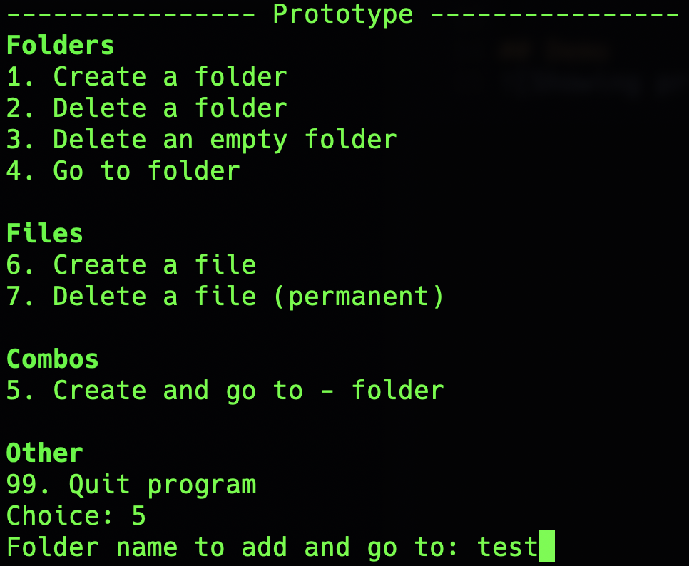

# Prototype
En Python app for å legge til, fjerne filer eller mapper, eller bytte mapper lettere enn manuelt på terminalen. Kombinasjoner inkludert.


## Kjøring
```sh
python3 main.py
```

> [!NOTE]
> Bytt til python eller py fra python3 hvis på Windows


## Demo

